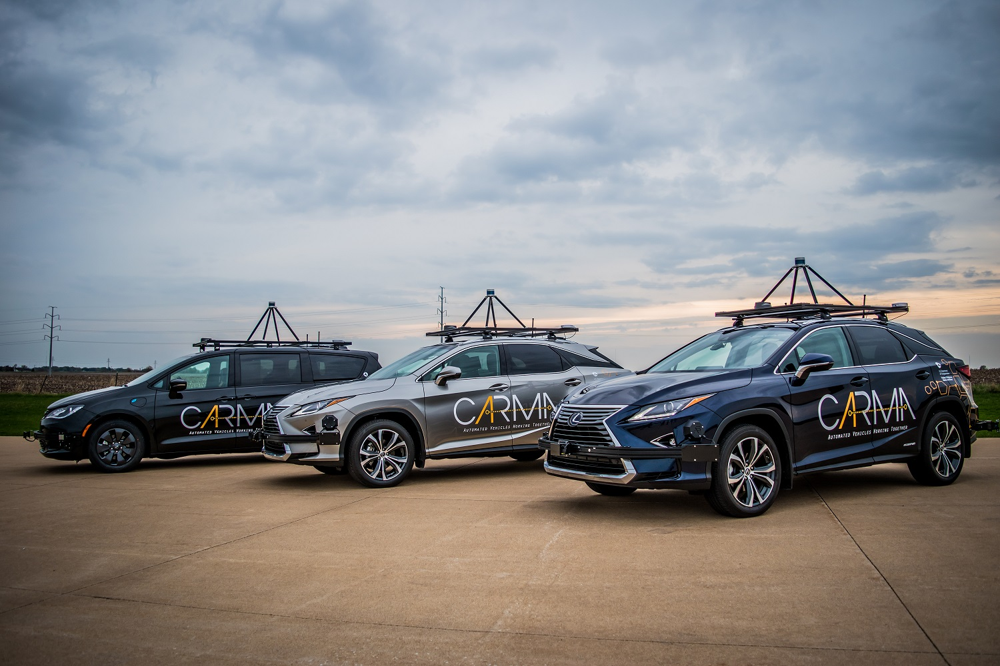
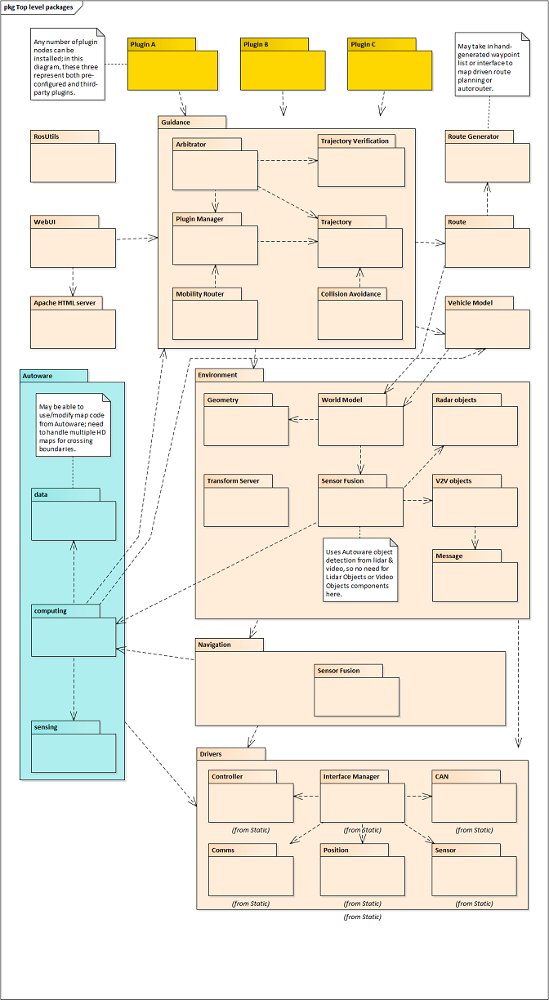

# Detailed Design
The CARMA Platform is a reusable and extensible platform to support research in connected and cooperative vehicle operations over the next several years. The architecture for this platform has been described in the CARMA Platform Architecture Document. This set of documents picks up from that high level description and presents additional details of both the hardware and software design. The design presented here represents an as-built view of the platform, v2.7.2, as of August 2018. [CARMA Detail Design](https://usdot-carma.atlassian.net/wiki/spaces/CAR/pages/23330913/CARMA+Project+Documentation?preview=/23330913/29589570/CAV%20Platform%20Detailed%20Design.docx)

## Software Package Detailed Designs
The following package diagram is repeated from the Architecture Document for easy reference. It serves as a visual index to the rest of the detailed design. Each package of non-trivial complexity is described in its own separate design document.

## Software Detailed Design Documents
The following table references the current CARMA3 detailed design documents.  Only a few of the packages have been updated for use in CARMA3 at this point, but new ones are continually being added. 

|Package|Attached Document(s)|
|----|-----------|
|Arbitrator|[CAV Platform Detailed Design - Arbitrator](https://usdot-carma.atlassian.net/wiki/spaces/CAR/pages/196182019/CARMA3+Project+Documentation?preview=/196182019/197001236/CAV%20Platform%20Detailed%20Design%20-%20Velodyne%20Lidar%20Driver%20Wrapper.docx)
|PACMOD CAN Wrapper|[CAV Platform Detailed Design - PACMOD CAN Wrapper](https://usdot-carma.atlassian.net/wiki/spaces/CAR/pages/196182019/CARMA3+Project+Documentation?preview=/196182019/196837399/CAV%20Platform%20Detailed%20Design%20-%20PACMOD%20CAN%20Wrapper.docx)
|Passenger Car Vehicle Model|[CAV Platform Detailed Design - Passenger Car Vehicle Model](https://usdot-carma.atlassian.net/wiki/spaces/CAR/pages/196182019/CARMA3+Project+Documentation?preview=/196182019/197033985/CAV%20Platform%20Detailed%20Design%20-%20PassangerCarVehicleModel.docx)
|SSC Interface Wrapper|[CAV Platform Detailed Design - SSC Interface Wrapper](https://usdot-carma.atlassian.net/wiki/spaces/CAR/pages/196182019/CARMA3+Project+Documentation?preview=/196182019/196771859/CAV%20Platform%20Detailed%20Design%20-%20SSC%20Interface%20Wrapper.docx)
|Trajectory Executor|[CAV Platform Detailed Design - Trajectory Executor](https://usdot-carma.atlassian.net/wiki/spaces/CAR/pages/196182019/CARMA3+Project+Documentation?preview=/196182019/197001223/CAV%20Platform%20Detailed%20Design%20-%20Trajectory%20Executor.docx)
|VehicleModelLib|[CAV Platform Detailed Design - VehicleModelLib](https://usdot-carma.atlassian.net/wiki/spaces/CAR/pages/196182019/CARMA3+Project+Documentation?preview=/196182019/197001223/CAV%20Platform%20Detailed%20Design%20-%20Trajectory%20Executor.docx)
|Velodyne Lidar Driver Wrapper|[CAV Platform Detailed Design - Velodyne Lidar Driver Wrapper](https://usdot-carma.atlassian.net/wiki/spaces/CAR/pages/196182019/CARMA3+Project+Documentation?preview=/196182019/197001236/CAV%20Platform%20Detailed%20Design%20-%20Velodyne%20Lidar%20Driver%20Wrapper.docx)

For packages not documented in the table above, please see the [CARMA2 detailed design documentation](https://usdot-carma.atlassian.net/wiki/spaces/CAR/pages/23330913/CARMA2+Project+Documentation)
