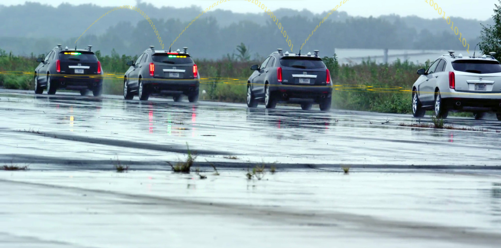
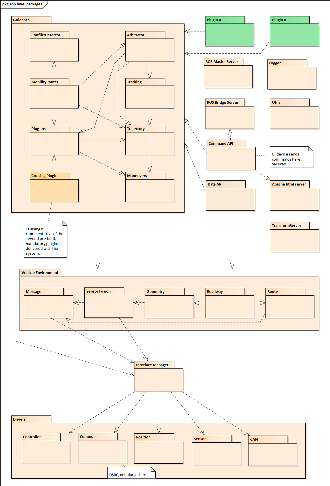

# Detailed Design Page
The Connected and Automated Vehicle (CAV) Platform that is the subject of the STOL II, Task Order 13, and work is being built as a reusable and extensible platform to support research in connected and cooperative vehicle operations over the next several years. The architecture for this platform has been described in the CARMA Platform Architecture Document. This document picks up from that high level description and presents additional details of both the hardware and software design. The design presented here represents an as-built view of the platform, v2.7.2, as of August 2018. [CARMA Detail Design](https://usdot-carma.atlassian.net/wiki/spaces/CAR/pages/23330913/CARMA+Project+Documentation?preview=/23330913/29589570/CAV%20Platform%20Detailed%20Design.docx)

## Software Package Detailed Designs
The following package diagram is repeated from the Architecture Document for easy reference. It serves as a visual index to the rest of the detailed design. Each package of non-trivial complexity is described in its own separate design document.

## Software Detailed Design Documents
The following table identifies the documents covering each of the packages.  

|Package|Attached Document(s)|
|----|-----------|
|Guidance|[CAV Platform Detailed Design – Guidance](https://usdot-carma.atlassian.net/wiki/spaces/CAR/pages/23330913/CARMA+Project+Documentation?preview=/23330913/29589642/CAV%20Platform%20Detailed%20Design%20-%20Guidance.docx0)
|Guidance.Arbitrator|[CAV Platform Detailed Design – Arbitrator](https://usdot-carma.atlassian.net/wiki/spaces/CAR/pages/23330913/CARMA+Project+Documentation?preview=/23330913/35323905/CAV%20Platform%20Detailed%20Design%20-%20Arbitrator.docx)
|Guidance.Tracking|[CAV Platform Detailed Design – Guidance.Tracking](https://usdot-carma.atlassian.net/wiki/spaces/CAR/pages/23330913/CARMA+Project+Documentation?preview=/23330913/35618850/CAV%20Platform%20Detailed%20Design%20-%20Guidance.Tracking.docx)
|Guidance.Trajectory|[CAV Platform Detailed Design – Trajectory](https://usdot-carma.atlassian.net/wiki/spaces/CAR/pages/23330913/CARMA+Project+Documentation?preview=/23330913/35717164/CAV%20Platform%20Detailed%20Design%20-%20Trajectory.docx)
|Guidance.Maneuvers|[CAV Platform Detailed Design – Maneuvers](https://usdot-carma.atlassian.net/wiki/spaces/CAR/pages/23330913/CARMA+Project+Documentation?preview=/23330913/37814273/CAV%20Platform%20Detailed%20Design%20-%20Maneuvers.docx)
|Guidance conflict handling (covers multiple packages)|[CAV Platform Detailed Design - Guidance.ConflictDetector](https://usdot-carma.atlassian.net/wiki/spaces/CAR/pages/23330913/CARMA+Project+Documentation?preview=/23330913/38633473/CAV%20Platform%20Detailed%20Design%20-%20Guidance.ConflictDetector.docx)
|Guidance.Plugins|[CAV Platform Detailed Design – Plugins](https://usdot-carma.atlassian.net/wiki/spaces/CAR/pages/23330913/CARMA+Project+Documentation?preview=/23330913/37912578/CAV%20Platform%20Detailed%20Design%20-%20Plugins.docx)
|Guidance.Cruising Plugins|[CAV Platform Detailed Design – Plug-ins.Cruising](https://usdot-carma.atlassian.net/wiki/spaces/CAR/pages/23330913/CARMA+Project+Documentation?preview=/23330913/37978138/CAV%20Platform%20Detailed%20Design%20-%20Plug-ins.Cruising.docx)
|Guidance.Platooning (not shown in digram)|[CAV Platform Detailed Design – Plug-ins.Platooning](https://usdot-carma.atlassian.net/wiki/spaces/CAR/pages/23330913/CARMA+Project+Documentation?preview=/23330913/38076417/CAV%20Platform%20Detailed%20Design%20-%20Plug-ins.Platooning.docx)
|Guidance.Lane Change Plugin (not shown in digram)|[CAV Platform Detailed Design - Lane Change Plugin](https://usdot-carma.atlassian.net/wiki/spaces/CAR/pages/23330913/CARMA+Project+Documentation?preview=/23330913/38666266/CAV%20Platform%20Detailed%20Design%20-%20Lane%20Change%20Plugin.docx)
|Guidance.Speed Harm Plugin (not shown in digram)|[CAV Platform Detailed Design – Plugins.SpeedHarmonization](https://usdot-carma.atlassian.net/wiki/spaces/CAR/pages/23330913/CARMA+Project+Documentation?preview=/23330913/35749942/CAV%20Platform%20Detailed%20Design%20-%20Plug-ins.SpeedHarmonization.docx)
|Transform Sever|[CAV Platform Detailed Design – TransformServer](https://usdot-carma.atlassian.net/wiki/spaces/CAR/pages/23330913/CARMA+Project+Documentation?preview=/23330913/35618858/CAV%20Platform%20Detailed%20Design%20-%20TransformServer.docx)
|Logger|[CAV Platform Detailed Design – Logging](https://usdot-carma.atlassian.net/wiki/spaces/CAR/pages/23330913/CARMA+Project+Documentation?preview=/23330913/40927282/CAV%20Platform%20Detailed%20Design%20-%20Logging.docx)
|Operator UI|[CAV Platform Detailed Design – Operator.UI](https://usdot-carma.atlassian.net/wiki/spaces/CAR/pages/23330913/CARMA+Project+Documentation?preview=/23330913/40894506/CAV%20Platform%20Detailed%20Design%20-%20Operator%20UI.docx)
|Vehicle Environment.Roadway|[CAV Platform Detailed Design – RoadwayEnvironment](https://usdot-carma.atlassian.net/wiki/spaces/CAR/pages/23330913/CARMA+Project+Documentation?preview=/23330913/35323924/CAV%20Platform%20Detailed%20Design%20-%20RoadwayEnvironment.docx)
|Vehicle Environment.Message|[CAV Platform Detailed Design – Message](https://usdot-carma.atlassian.net/wiki/spaces/CAR/pages/23330913/CARMA+Project+Documentation?preview=/23330913/41025565/CAV%20Platform%20Detailed%20Design%20-%20Message.docx)
|Vehicle Environment.Sensor Fusion|[CAV Platform Detailed Design – Sensor Fusion](https://usdot-carma.atlassian.net/wiki/spaces/CAR/pages/23330913/CARMA+Project+Documentation?preview=/23330913/44302337/CAV%20Platform%20Detailed%20Design%20-%20Sensor%20Fusion.docx)
|Vehicle Environment.Geometry|[CAV Platform Detailed Design – Geometry](https://usdot-carma.atlassian.net/wiki/spaces/CAR/pages/23330913/CARMA+Project+Documentation?preview=/23330913/38043655/CAV%20Platform%20Detailed%20Design%20-%20Geometry.docx)
||[CAV Platform Detailed Design – Geometry.Cartesian](https://usdot-carma.atlassian.net/wiki/spaces/CAR/pages/23330913/CARMA+Project+Documentation?preview=/23330913/37912617/CAV%20Platform%20Detailed%20Design%20-%20Geometry.Cartesian.docx)
||[CAV Platform Detailed Design – Geometry.Geodesic](https://usdot-carma.atlassian.net/wiki/spaces/CAR/pages/23330913/CARMA+Project+Documentation?preview=/23330913/35323929/CAV%20Platform%20Detailed%20Design%20-%20Geometry.Geodesic.docx)
|Vehicle Environment.Route|[CAV Platform Detailed Design – Route](https://usdot-carma.atlassian.net/wiki/spaces/CAR/pages/23330913/CARMA+Project+Documentation?preview=/23330913/37912635/CAV%20Platform%20Detailed%20Design%20-%20Route.docx)
|Interface Manager|[CAV Platform Detailed Design – Interface Mgr](https://usdot-carma.atlassian.net/wiki/spaces/CAR/pages/23330913/CARMA+Project+Documentation?preview=/23330913/38076452/CAV%20Platform%20Detailed%20Design%20-%20Interface%20Mgr.docx)
|Drivers.Controller|[CAV Platform Detailed Design – SRX Controller Driver](https://usdot-carma.atlassian.net/wiki/spaces/CAR/pages/23330913/CARMA+Project+Documentation?preview=/23330913/37748766/CAV%20Platform%20Detailed%20Design%20-%20SRX%20Controller%20Driver.docx)
||[CAV Platform Detailed Design – Truck Controller Driver](https://usdot-carma.atlassian.net/wiki/spaces/CAR/pages/23330913/CARMA+Project+Documentation?preview=/23330913/40894524/CAV%20Platform%20Detailed%20Design%20-%20Truck%20Controller%20Driver.docx)
||[CAV Platform Detailed Design – XGV Controller Driver](https://usdot-carma.atlassian.net/wiki/spaces/CAR/pages/23330913/CARMA+Project+Documentation?preview=/23330913/37945410/CAV%20Platform%20Detailed%20Design%20-%20XGV%20Controller%20Driver.docx)
|Drivers.DSRC Comms.|[CAV Platform Detailed Design – DSRC OBU Driver](https://usdot-carma.atlassian.net/wiki/spaces/CAR/pages/23330913/CARMA+Project+Documentation?preview=/23330913/38633504/CAV%20Platform%20Detailed%20Design%20-%20DSRC%20OBU%20Driver.docx)
|Drivers.Position|[CAV Platform Detailed Design – Pinpoint Driver](https://usdot-carma.atlassian.net/wiki/spaces/CAR/pages/23330913/CARMA+Project+Documentation?preview=/23330913/40828970/CAV%20Platform%20Detailed%20Design%20-%20Pinpoint%20Driver.docx)
|Drivers.Sensor|**Sensitive Document below please contact the CARMA Development Team**
||CAV Platform Detailed Design – SRX Radar Driver]
||[CAV Platform Detailed Design – Delphi Radar Driver](https://usdot-carma.atlassian.net/wiki/spaces/CAR/pages/23330913/CARMA+Project+Documentation?preview=/23330913/38633509/CAV%20Platform%20Detailed%20Design%20-%20Delphi%20Radar%20Driver.docx)
|Drivers.CAN|**Sensitive Documents below please contact the CARMA Development Team**
||CAV Platform Detailed Design – SRX CAN Driver 
||CAV Platform Detailed Design – Truck CAN Drive
|System installation, configuration and startup (not shown in digram)|[CAV Platform Detailed Design – LaunchScript](https://usdot-carma.atlassian.net/wiki/spaces/CAR/pages/23330913/CARMA+Project+Documentation?preview=/23330913/40927236/CAV%20Platform%20Detailed%20Design%20-%20LaunchScript.docx)
||[CAV Platform Remote Install and Launch](https://usdot-carma.atlassian.net/wiki/spaces/CAR/pages/23330913/CARMA+Project+Documentation?preview=/23330913/37748788/CAV%20Platform%20Remote%20Install%20and%20Launch.docx)
||[CAV Platform Vehicle Configuration](https://usdot-carma.atlassian.net/wiki/spaces/CAR/pages/23330913/CARMA+Project+Documentation?preview=/23330913/37978189/CAV%20Platform%20Vehicle%20Configuration.docx)
||[CAV Platform Vehicle PC Setup](https://usdot-carma.atlassian.net/wiki/spaces/CAR/pages/23330913/CARMA+Project+Documentation?preview=/23330913/37945418/CAV%20Platform%20Vehicle%20PC%20Setup.docx)
||[CAV Platform Vehicle PC Structure and Use](https://usdot-carma.atlassian.net/wiki/spaces/CAR/pages/23330913/CARMA+Project+Documentation?preview=/23330913/38043769/CAV%20Platform%20Vehicle%20PC%20Structure%20and%20Use.docx)
