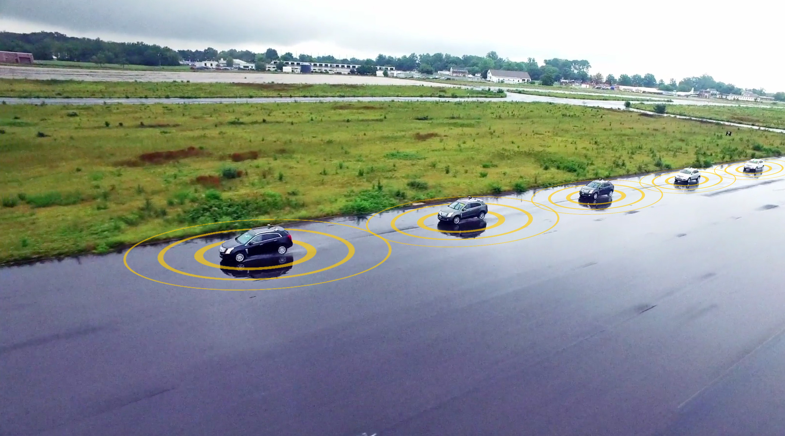

# Detailed Design Page
The Connected and Automated Vehicle (CAV) Platform that is the subject of the STOL II, Task Order 13, and work is being built as a reusable and extensible platform to support research in connected and cooperative vehicle operations over the next several years. The architecture for this platform has been described in the CARMA Platform Architecture Document. This document picks up from that high level description and presents additional details of both the hardware and software design. The design presented here represents an as-built view of the platform, v2.7.2, as of August 2018. [CARMA Detail Design](https://usdot-carma.atlassian.net/wiki/spaces/CAR/pages/23330913/CARMA+Project+Documentation?preview=/23330913/29589570/CAV%20Platform%20Detailed%20Design.docx)

## Software Package Detailed Designs
The following package diagram is repeated from the Architecture Document for easy reference. It serves as a visual index to the rest of the detailed design. Each package of non-trivial complexity is described in its own separate design document.

## Software Detailed Design Documents
The following table identifies the documents covering each of the packages.  

|Name|Visibility|Description|
|----|----------|-----------|
|[jpo-ode](https://github.com/usdot-jpo-ode/jpo-ode)|public|Contains the public components of the application code.|
|[jpo-cvdp](https://github.com/usdot-jpo-ode/jpo-cvdp)|public|Privacy Protection Module|
|[jpo-s3-deposit](https://github.com/usdot-jpo-ode/jpo-s3-deposit)|public|S3 depositor service. Optional, comment out of `docker-

CARMA provides the navigation and guidance functions for its host vehicle, as well as some of the control functions.  It depends on low level controller hardware to provide the rest of the control function.  The current version of CARMA is limited to longitudinal (speed) control, so a human operator needs to control the steering wheel.  The next major update to CARMA will include lateral (steering) control as well, for full SAE level 2 autonomy.

## Documentation

## System Specifications
The platform's performance requirements are specified to conform the following performance requirements. Performance requirements shall only be applicable to the platform being developed, including Android tablets and GUIs; computers, software, positioning units, and processors that are not part of the OEM vehicle. The functional requirements are specified to confirm the following functional requirements.  Functional requirements shall be applicable to the platform being developed, including the vehicle's control, MAP and SPAT messages, etc.
[Performance Requirements](https://usdot-carma.atlassian.net/wiki/spaces/CAR/pages/11304971/CARMA2+Draft+Performance+Requirements) and 
[Functional Requirements](https://usdot-carma.atlassian.net/wiki/spaces/CAR/pages/7864327/CARMA2+Functional+Requirements)

## Release Notes
The current version release of the CARMA software platform. [CARMA Release Notes](<docs/Release_notes.md>)

## Architecture Guide
The documentation describes the architecture of a single CARMA vehicle.  There may be several of these vehicles operating in concert, communicating with each other via DSRC or cellular means.  They can also communicate with roadside infrastructure using DSRC or cellular.  The communication among software components within a single vehicle, however, is mostly done via the Robot Operating System (ROS) framework.  There are no ROS communications between neighboring vehicles. [CARMA Architecture Guide](https://usdot-carma.atlassian.net/wiki/spaces/CAR/pages/23330913/CARMA+Project+Documentation?preview=/23330913/29589549/CAMAR%20Platform%20Architecture.docx)

## Detailed Design Documents
The Connected and Automated Vehicle (CAV) Platform that is the subject of the STOL II, Task Order 13, and work is being built as a reusable and extensible platform to support research in connected and cooperative vehicle operations over the next several years. The architecture for this platform has been described in the CARMA Platform Architecture Document. This document picks up from that high level description and presents additional details of both the hardware and software design. The design presented here represents an as-built view of the platform, v2.7.2, as of August 2018. [CARMA Detail Design](https://usdot-carma.atlassian.net/wiki/spaces/CAR/pages/23330913/CARMA+Project+Documentation?preview=/23330913/29589570/CAV%20Platform%20Detailed%20Design.docx)

### Other Supporting Detailed Design Documents 
CARMA provides the following living documents to keep users and stakeholders informed of the latest developments:
1. [CAV Platform Detailed Design - Guidance](docs/JPO%20ODE%20Architecture.docx)
2. [CAV Platform Detailed Design - Plugins](docs/JPO_ODE_UserGuide.docx)
3. [CAV Platform Detailed Design - Plug-ins.Cruising](docs/ODE_Output_Schema_Reference.docx)
4. [CAV Platform Detailed Design - Arbitrator](https://usdot-jpo-ode.github.io/)
5. [CAV Platform Detailed Design - Guidance.Tracking](https://github.com/usdot-jpo-ode/jpo-ode/wiki/JPO-ODE-QA-Documents)
6. [CAV Platform Detailed Design - Trajectory](https://github.com/usdot-jpo-ode/jpo-ode/wiki/JPO-ODE-QA-Documents)
7. [CAV Platform Detailed Design - Maneuvers](https://github.com/usdot-jpo-ode/jpo-ode/wiki/JPO-ODE-QA-Documents)
8. [CAV Platform Detailed Design - Logging](https://github.com/usdot-jpo-ode/jpo-ode/wiki/JPO-ODE-QA-Documents)
9. [CAV Platform Detailed Design - CommandandDataAPI](https://github.com/usdot-jpo-ode/jpo-ode/wiki/JPO-ODE-QA-Documents)
10. [CAV Platform Detailed Design - Environment.Message](https://github.com/usdot-jpo-ode/jpo-ode/wiki/JPO-ODE-QA-Documents)
11. [CAV Platform Detailed Design - Sensor Fusion](https://github.com/usdot-jpo-ode/jpo-ode/wiki/JPO-ODE-QA-Documents)
12. [CAV Platform Detailed Design - Geometry](https://github.com/usdot-jpo-ode/jpo-ode/wiki/JPO-ODE-QA-Documents)

## Developers Guide 
This guide describes the overall approach to develop a plug-in. [Developers Guide](https://usdot-carma.atlassian.net/wiki/spaces/CAR/pages/23330913/CARMA+Project+Documentation?preview=/23330913/29556796/CARMA%202.7%20Developers%20Guide.docx)

## Users Guide
This guide describes the PC configuration steps necessary to install and run the CARMA platform. The steps match what the development team performed on their own PCs and some configuration may be different for other users. [CARMA User Guide](https://usdot-carma.atlassian.net/wiki/spaces/CAR/pages/23330913/CARMA+Project+Documentation?preview=/23330913/29392940/CARMA%202.7%20USER%20GUIDE.docx)

## Administrator Guide
This guide describes [Administrator Guide](https://usdot-carma.atlassian.net/wiki/spaces/CAR/pages/23330913/CARMA+Project+Documentation?preview=/23330913/29392940/CARMA%202.7%20USER%20GUIDE.docx)

## Contribution
Welcome to the CARMA contributing guide. Please read this guide to learn about our development process, how to propose pull requests and improvements, and how to build and test your changes to this project. [CARMA Contributing Guide](docs/Contributing.md) 

## License
By contributing to the Federal Highway Administration (FHWA) Connected Automated Research Mobility Applications (CARMA), you agree that your contributions will be licensed under its Apache License 2.0 license. [CARMA License](<docs/License.md>) 

## Contact

