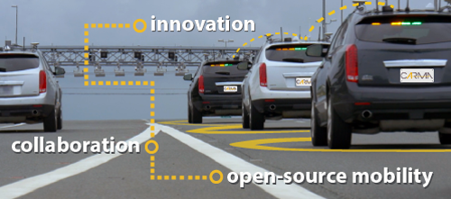
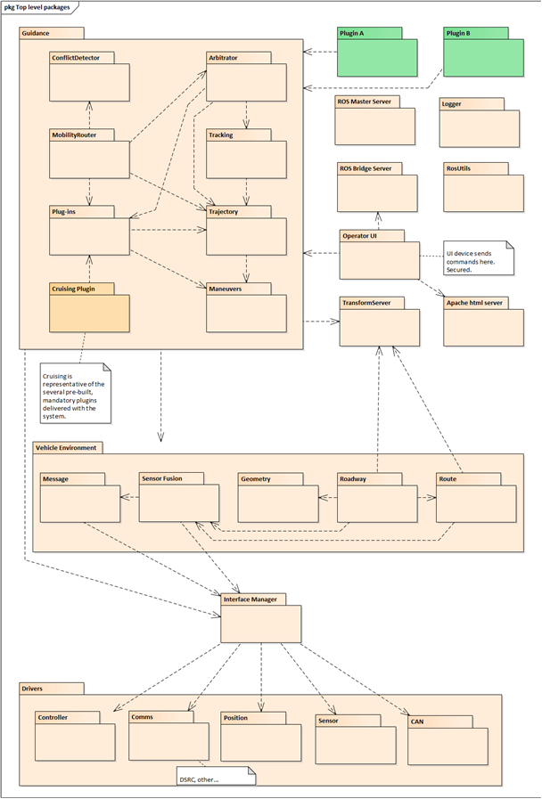

# CARMA

**Cooperative Automated Research Mobility Applications (CARMA)**, CARMA is a reusable, extensible platform for controlling SAE level 1 connected, automated vehicles (CAVs). It provides a rich, generic API for third party plugins that implement vehicle guidance algorithms. It is written in Java and C++ and runs in a Robot Operating System (ROS) environment. It offers a rich application programming interface (API) for third party authors to develop guidance plugins that can plan vehicle trajectories under certain conditions. The platform can be reused on a variety of properly equipped vehicles.

## What Is CARMA

Managing automated vehicle motion involves three aspects. The first is **navigation, also know as localization**, which is the act of determining where the vehicle currently is with respect to the earth and with respect to the desired path of travel (its planned route). The second is **guidance, also know as path planning**, which includes the processes of determining how the vehicle is to move from its current location to its destination. The destination and route will be handed to the guidance algorithms, and they then determine how the vehicle’s motion needs to be adjusted at any time in order to follow the route. The third aspect of automated vehicle motion is **control**, which covers the actuation of the vehicle’s physical devices to induce changes in motion (for land vehicles these are typically causing the wheels to rotate faster or slower and turning the steering wheel). Therefore, the navigation solution becomes an input to the guidance function, and the guidance solution becomes an input to the control function. As the vehicle moves, obviously its location changes so that the navigation function constantly needs to update its solution and the cycle iterates as quickly as necessary to produce a smooth and accurate vehicle motion. The rate of iteration is largely determined by the expected speed of the vehicle.

CARMA provides the navigation and guidance functions for its host vehicle, as well as some of the control functions.  It depends on low level controller hardware to provide the rest of the control function.  The current version of CARMA is limited to longitudinal (speed) control, so a human operator needs to control the steering wheel.  The next major update to CARMA will include lateral (steering) control as well, for full SAE level 2 autonomy.

## Documentation

## System Specifications
The platform's performance requirements are specified to conform the following performance requirements. Performance requirements shall only be applicable to the platform being developed, including Android tablets and GUIs; computers, software, positioning units, and processors that are not part of the OEM vehicle. The functional requirements are specified to confirm the following functional requirements.  Functional requirements shall be applicable to the platform being developed, including the vehicle's control, MAP and SPAT messages, etc.
[CAV Platform Requirements](https://usdot-carma.atlassian.net/wiki/spaces/CAR/pages/56786945/Platform+Requirements+Document?preview=/56786945/56852481/CAV%20Platform%20Requirements.docx)

## Release Notes
The current version release of the CARMA software platform. [CARMA Release Notes](<docs/Release_notes.md>)

## Roadmap
The current CARMA development direction and release plans. [CARMA Roadmap](<docs/Roadmap.md>)

## Architecture Guide
The documentation describes the architecture of a single CARMA vehicle.  There may be several of these vehicles operating in concert, communicating with each other via DSRC or cellular means.  They can also communicate with roadside infrastructure using DSRC or cellular.  The communication among software components within a single vehicle, however, is mostly done via the Robot Operating System (ROS) framework.  There are no ROS communications between neighboring vehicles. [CARMA Architecture Guide](https://usdot-carma.atlassian.net/wiki/spaces/CAR/pages/23330913/CARMA+Project+Documentation?preview=/23330913/29589549/CARMA%20Platform%20Architecture.docx)

## Detailed Design Documents
Please see the Detail Design document page for detailed design specification for CARMA and other additional information.
[Detail Design Page](Detail_Design.md)

## Developers Guide 
This guide describes the overall approach to develop a plug-in. [Developers Guide](https://usdot-carma.atlassian.net/wiki/spaces/CAR/pages/23330913/CARMA+Project+Documentation?preview=/23330913/29556796/CARMA%202.7%20Developers%20Guide.docx)

## Users Guide
The User Guide describes the complete functionality specific to the Cadillac SRX. Some vehicle IPs/power procedures may change when using other vehicles. [CARMA User Guide](https://usdot-carma.atlassian.net/wiki/spaces/CAR/pages/23330913/CARMA+Project+Documentation?preview=/23330913/29392940/CARMA%202.7%20USER%20GUIDE.docx)

## Administrator Guide
This guide describes the vehicle and developer PC configuration, build, deployment and testing steps necessary to install and run the CARMA platform. [Administrator Guide](https://usdot-carma.atlassian.net/wiki/spaces/CAR/pages/23330913/CARMA+Project+Documentation?preview=/23330913/29196388/CARMA%20Administrator%20Guide.docx)

## Other CARMA Packages
The CARMAPlatform is distributed as a set of multiple independent packages hosted in separate Github repositories. These packages facilitate operation of the CARMA platform with different hardware configurations or allow it to support different modes of operation. To include one of these packages in your build of the CARMAPlatform system please clone the Github repository into the same Catkin workspace `src/` folder as this repository. The Catkin build system will verify that dependencies are resolved appropriately and build the newly included package when you next run `catkin_make`. An incomplete listing of available packages includes:

### Vehicle Controller Interface Drivers
* [CARMACadillacSrx2013ControllerDriver](https://github.com/usdot-fhwa-stol/CARMACadillacSrx2013ControllerDriver)
* [CARMAFreightliner2012ControllerDriver](https://github.com/usdot-fhwa-stol/CARMAFreightliner2012ControllerDriver)
* [CARMATorcXgvControllerDriver](https://github.com/usdot-fhwa-stol/CARMATorcXgvControllerDriver)

### Sensor Drivers
* [CARMATorcPinpointDriver](https://github.com/usdot-fhwa-stol/CARMATorcPinpointDriver)
* [CARMADelphiEsrDriver](https://github.com/usdot-fhwa-stol/CARMADelphiEsrDriver)
* [CARMACohdaDsrcDriver](https://github.com/usdot-fhwa-stol/CARMACohdaDsrcDriver)

### General System Utilites
* [CARMAWebUi](https://github.com/usdot-fhwa-stol/CARMAWebUi)
* [CARMAMsgs](https://github.com/usdot-fhwa-stol/CARMAMsgs)
* [CARMADriverUtils](https://github.com/usdot-fhwa-stol/CARMADriverUtils)

A full list of available packages may be found at in the [USDOT FHWA STOL](https://github.com/usdot-fhwa-stol) Github organization.

## Contribution
Welcome to the CARMA contributing guide. Please read this guide to learn about our development process, how to propose pull requests and improvements, and how to build and test your changes to this project. [CARMA Contributing Guide](Contributing.md) 

## Code of Conduct 
Please read our [CARMA Code of Conduct](Code_of_Conduct.md) which outlines our expectations for participants within the CARMA community, as well as steps to reporting unacceptable behavior. We are committed to providing a welcoming and inspiring community for all and expect our code of conduct to be honored. Anyone who violates this code of conduct may be banned from the community.

## Attribution
The development team would like to acknowledge the people who have made direct contributions to the design and code in this repository. [CARMA Attribution](ATTRIBUTION.txt) 

## License
By contributing to the Federal Highway Administration (FHWA) Connected Automated Research Mobility Applications (CARMA), you agree that your contributions will be licensed under its Apache License 2.0 license. [CARMA License](<docs/License.md>) 

## Contact
Please click on the CARMA logo below to visit the Federal Highway Adminstration(FHWA) CARMA website.

