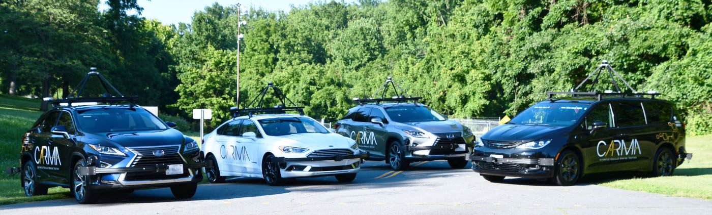
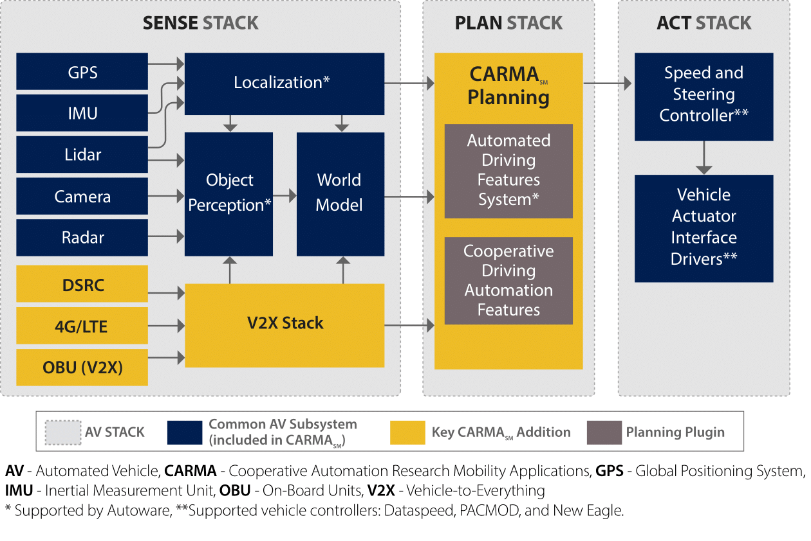
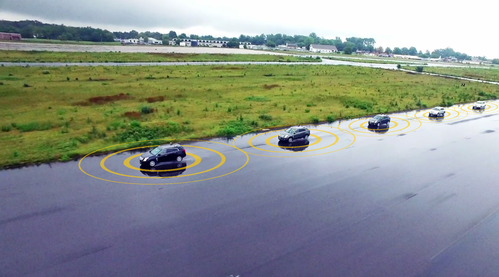

| CicleCI Build Status | Sonar Code Quality |
|----------------------|---------------------|
 |  |

# CARMA

CARMASM  advances research and development to accelerate market readiness and deployment of cooperative driving automation, while advancing automated driving technology safety, security, data, and artificial intelligence. It encourages collaboration and participation by a community of engineers and researchers to advance understanding of cooperative driving automation using open source software (OSS) and agile project management practices. 

CARMA is a reusable, extensible platform for controlling SAE level 2 connected, automated vehicles (AVs). It provides a rich, generic API for third party plugins that implement vehicle guidance algorithms that plan vehicle trajectories. It is written in Java and C++ and runs in a Robot Operating System (ROS) environment. The platform can be reused on a variety of properly equipped vehicles.

This readme updated: February 7th, 2020

## What Is CARMA

Managing automated vehicle motion involves three aspects. The first is **navigation, also known as localization**, which is the act of determining where the vehicle currently is with respect to the earth and with respect to the desired path of travel (its planned route). The second is **guidance, also known as trajectory planning**, which includes the processes of determining how the vehicle is to move from its current location to its destination. The destination and route will be handed to the guidance algorithms, and they then determine how the vehicle’s motion needs to be adjusted at any time in order to follow the route. The third aspect of automated vehicle motion is **control**, which covers the actuation of the vehicle’s physical devices to induce changes in motion (for land vehicles these are typically causing the wheels to rotate faster or slower and turning the steering wheel). Therefore, the navigation solution becomes an input to the guidance function, and the guidance solution becomes an input to the control function. As the vehicle moves, obviously its location changes so that the navigation function constantly needs to update its solution and the cycle iterates as quickly as necessary to produce a smooth and accurate vehicle motion. The rate of iteration is largely determined by the expected speed of the vehicle.

CARMA provides the navigation and guidance functions for its host vehicle, as well as some of the control functions.  It depends on low level controller hardware to provide the rest of the control function.  The current version of CARMA provides SAE level 2+ autonomy, with both speed and steering control.

## Documentation

<!-- We would like to publish this section, but are not ready to at this time:
## System Specifications
The current CARMA requirements specification: [CARMA Platform Requirements](https://usdot-carma.atlassian.net/wiki/spaces/CAR/pages/56786945/Platform+Requirements+Document?preview=/56786945/56852481/CAV%20Platform%20Requirements.docx)
-->

## Release Notes
The current version and release history of the CARMA software platform: [CARMA Release Notes](<docs/Release_notes.md>)

**Repo Structure Note:**  The master and develop branches of this repo (and all other repos in the usdot-fhwa-stol GitHub organization) now reflects the third generation of CARMA code and documentation, called CARMA3.  It uses [Autoware](https://github.com/autowarefoundation/autoware) to provide SAE level 2 and 3 automation capability.  The legacy CARMA2 code is still being supported.  It was used extensively by FHWA during 2018 for SAE level 1 experiments.  To work with that code base, please check out the CARMA2-integration branch and make pull requests to it (using the contribution process outlined below).

## Roadmap
The current CARMA development direction and release plans. [CARMA Roadmap](<docs/Roadmap.md>)

## Architecture Guide
The documentation describes the software architecture within a single CARMA vehicle.  There may be several of these vehicles operating in concert, communicating with each other via DSRC or cellular means.  They can also communicate with roadside infrastructure using DSRC or cellular.  The communication among software components within a single vehicle, however, is mostly done via the Robot Operating System (ROS) framework.  There are no ROS communications between neighboring vehicles. [CARMA3 System Architecture](https://usdot-carma.atlassian.net/wiki/spaces/CAR/pages/89587713/CARMA3+System+Architecture?preview=/89587713/128680006/CARMA%203.0%20Platform%20Architecture%20v0.docx)

For information on the CARMA2 architecture, please see [CARMA2 System Architecture](https://usdot-carma.atlassian.net/wiki/spaces/CAR/pages/11403311/CARMA2+System+Architecture?preview=/11403311/130678837/CAV%20Platform%20Architecture.docx)

## Detailed Design Documents
Please see the Detail Design document page for detailed design specification for CARMA and other additional information.
[Detail Design Page](Detail_Design.md)

## Developers Guide 
A plug-in developers guide for CARMA3 will be coming soon.

For a description of the approach to develop a plug-in for CARMA2, please see [CARMA 2.7 Developers Guide](https://usdot-carma.atlassian.net/wiki/spaces/CAR/pages/23330913/CARMA+Project+Documentation?preview=/23330913/29556796/CARMA%202.7%20Developers%20Guide.docx)

## Users Guide
A user guide for CARMA3 will be coming soon.

For a description of the functionality specific to CARMA2 on the Cadillac SRX, see [CARMA User Guide](https://usdot-carma.atlassian.net/wiki/spaces/CAR/pages/23330913/CARMA+Project+Documentation?preview=/23330913/29392940/CARMA%202.7%20USER%20GUIDE.docx)

## Administrator Guide
An administrator guide for CARMA3 will be coming soon.

For administrative information on CARMA2, including vehicle and developer PC configuration, build, deployment and testing steps necessary to install and run CARMA Platform, please see [Administrator Guide](https://usdot-carma.atlassian.net/wiki/spaces/CAR/pages/23330913/CARMA+Project+Documentation?preview=/23330913/29196388/CARMA%20Administrator%20Guide.docx)

## Other CARMA Packages
CARMA PlatformSM is a downloadable, open source software (OSS) platform architected to be extensible and reusable for a wide variety of research purposes to advance innovation for cooperative driving automation. It enables communication between vehicles, road users such as pedestrians, bicyclists, and scooters, and infrastructure devices capable of communication. It promotes collaboration between a community of engineers and researchers to accelerate the development, testing, and evaluation of cooperative driving automation while advancing the safety, security, data, and use of artificial intelligence in automated driving technology. 

The CARMA Platform is distributed as a set of multiple independent packages hosted in separate Github repositories. These packages facilitate operation of the CARMA Platform with different hardware configurations or allow it to support different modes of operation. To include one of these packages in your build of the CARMA Platform system please clone the Github repository into the same Catkin workspace `src/` folder as this repository. The Catkin build system will verify that dependencies are resolved appropriately and build the newly included package when you next run `catkin_make`. An incomplete listing of available packages for CARMA2 includes:

### Vehicle Controller Interface Drivers
* [CARMACadillacSrx2013ControllerDriver](https://github.com/usdot-fhwa-stol/carma-cadillac-srx-2013-controller-driver)
* [CARMAFreightliner2012ControllerDriver](https://github.com/usdot-fhwa-stol/carma-freightliner-2012-controller-driver)
* [CARMATorcXgvControllerDriver](https://github.com/usdot-fhwa-stol/carma-torc-xgv-controller-driver)

### Sensor Drivers
* [CARMATorcPinpointDriver](https://github.com/usdot-fhwa-stol/carma-torc-pinpoint-driver)
* [CARMADelphiEsrDriver](https://github.com/usdot-fhwa-stol/carma-delphi-esr-driver)
* [CARMACohdaDsrcDriver](https://github.com/usdot-fhwa-stol/carma-cohda-dsrc-driver)

### General System Utilites
* [CARMAWebUi](https://github.com/usdot-fhwa-stol/carma-web-ui)
* [CARMAMsgs](https://github.com/usdot-fhwa-stol/carma-msgs)
* [CARMAUtils](https://github.com/usdot-fhwa-stol/carma-utils)

A full list of available packages may be found at in the [USDOT FHWA STOL](https://github.com/usdot-fhwa-stol) Github organization.

CARMA CloudSM is a downloadable, cloud-based open source software (OSS) service that provides information to support and enable cooperative driving automation. It enables communication with cloud services and vehicles, road users such as pedestrians, bicyclists, and scooters, and infrastructure devices capable of communication. It promotes collaboration between a community of engineers and researchers to accelerate the development, testing, and evaluation of cooperative driving automation while advancing the safety, security, data, and use of artificial intelligence in automated driving technology. The source code for CARMA Cloud can be found [here on GitHub](https://github.com/usdot-fhwa-stol/carma-cloud).

## Contribution
Welcome to the CARMA contributing guide. Please read this guide to learn about our development process, how to propose pull requests and improvements, and how to build and test your changes to this project. [CARMA Contributing Guide](Contributing.md) 

## Code of Conduct 
Please read our [CARMA Code of Conduct](Code_of_Conduct.md) which outlines our expectations for participants within the CARMA community, as well as steps to reporting unacceptable behavior. We are committed to providing a welcoming and inspiring community for all and expect our code of conduct to be honored. Anyone who violates this code of conduct may be banned from the community.

## Attribution
The development team would like to acknowledge the people who have made direct contributions to the design and code in this repository. [CARMA Attribution](ATTRIBUTION.md) 

## License
By contributing to the Federal Highway Administration (FHWA) Connected Automated Research Mobility Applications (CARMA), you agree that your contributions will be licensed under its Apache License 2.0 license. [CARMA License](<docs/License.md>) 

## Code.gov Registration Info

Agency: DOT

Short Description: Cooperative Automation Research Mobility Applications (CARMA) is an open source software (OSS) platform that runs on a computer inside of a vehicle, and the computer interacts with the vehicle's devices to enable cooperative automated vehicle research, development, and testing. The computer then gives the vehicle the information needed in order to interact and cooperate with infrastructure and other vehicles.Phase I of this project initiated the next generation of the CARMA fleet by developing a common platform infrastructure that will support the FHWA's strategic vision for Cooperative Automated Driving Systems (CADS). Phase I also developed the Integrated Highway Prototype (IHP) by integrating the existing applications and a new vehicle type, the heavy truck, into the CARMA fleet. The following five applications are major research areas: (1) Vehicle Platooning, (2) Signalized Intersection Approach and Departure, (3) Infrastructure guided Speed Harmonization, and (4) Cooperative Lane Change, and (5) Cooperative Ramp Merge.Phase II of this project will advance CADS, which was developed on the FHWA's CARMA research platform to allow testing of arbitration and negotiation strategies. Ultimately, this project will enhance infrastructure efficiency and reduce traffic congestion. One of the goals of this project is to accelerate the technology transfer and deployment of cooperative vehicle applications through open source collaboration with industry and stakeholders. This project will enable Society of Engineers (SAE) Level 2 and Level 3 (L2/3) light vehicle testing capabilities and develop a fleet of four SAE L2/3 heavy vehicles. The project will also develop a high-level concept for Transportation System Management and Operations (TSMO) around the use of automated driving technology. Furthermore, this project will identify Traffic Incident Management (TIM) scenarios that provide strategy improvements and new strategies for first responder use cases interacting with ADS and using ADS. The new FHWA fleet will be used to prototype a scenario for each of the following use case categories: (1) Basic Travel, (2) Work Zone, (3) Traffic Incident Management and (4) Weather. These tests will provide objective data to inform stakeholders about the impacts of ADS and possible strategies to use ADS to improve operations.

Status: Beta

Tags: transportation, cooperative driving automation, connected vehicles, intelligent transportation systems, C++, java, python, docker

Labor hours: 200

Contact Name: James Lieu

Contact Phone: (202) 366-3000

## Contact
Please click on the CARMA logo below to visit the Federal Highway Adminstration(FHWA) CARMA website. For more information, contact CARMA@dot.gov.

## Support
For technical support from the CARMA team, please contact the CARMA help desk at CARMASupport@dot.gov.
