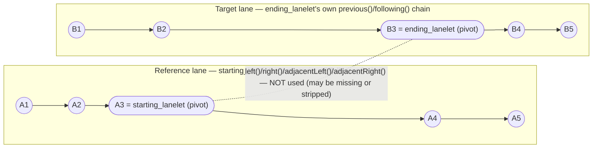
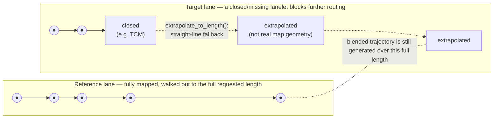

# basic_autonomy

The basic_autonomy library includes functions for waypoint processing, which are used by tactical plugins in order to generate detailed trajectories for the CARMA system. 

## Lane Change Geometry (CLC)

`create_lanechange_geometry` (`src/basic_autonomy.cpp`) builds the trajectory geometry for a lane
change maneuver, such as the one used by the `cooperative_lanechange` plugin. It blends a
centerline from the starting/reference lane into a centerline from the ending/target lane over the
length of the lane change, plus a trailing buffer.

### Core logic: walk each lane's own chain, not "what's adjacent"

The two centerlines are built independently by `build_chain_centerline` (`src/helper_functions.cpp`),
one call per lane, each starting from a single pivot lanelet (`starting_lanelet` for the reference
lane, `ending_lanelet` for the target lane) and walking outward along *that lanelet's own*
`previous()`/`following()` chain in the routing graph until enough length is covered.

This deliberately avoids ever asking "what lanelet is adjacent/left/right of lanelet X" for the
lanelets along the way. Lateral adjacency (`left()`/`right()`/`adjacentLeft()`/`adjacentRight()`)
requires the two lanes' boundaries to be explicitly linked in the map (literally the same boundary
linestring), which can be missing or stripped -- e.g. a `TrafficControlMessage` closing a lanelet,
or lanelets that were simply never linked in the source map. `previous()`/`following()` only require
that a lanelet be routable, a much weaker and more commonly-satisfied requirement. Because of this,
`starting_lanelet` and `ending_lanelet` do not need to be adjacent to each other or the same length
-- they just each need to sit on an *accessible* (routable) chain within their own lane, walked as
far forward/backward as needed to cover the lane change length plus buffer. In other words: pull in
as much of the routing graph as is actually reachable, independently per lane, rather than relying on
cross-lane linkage that may not exist.

If a lane's chain runs out before covering the required length (e.g. a closed or unmapped lanelet
blocks further routing), `extrapolate_to_length` pads the centerline with a straight-line
extrapolation instead of throwing, so trajectory generation always produces a usable result.

Each lane is walked as its own self-contained chain (solid arrows = `previous()`/`following()`,
followed backward from the pivot for `backward_length` and forward for `forward_length`). The only
place the two lanes would ever meet -- a direct lateral link between `A3` and `B3` -- is exactly what
this logic avoids depending on, shown as the dotted, unused edge above.

### Limitation: mismatched lane lengths can extrapolate over unavailable map

Because of that straight-line fallback, if the reference and target lanes' accessible chains end up
covering different actual lengths -- for example, part of one lane is missing from the map or closed
by a traffic control message while the other lane is intact -- CLC will still successfully generate a
trajectory rather than failing. Part of that trajectory, however, may be an extrapolated straight line
that does not correspond to real, drivable lane geometry. If the vehicle is actually routed over that
extrapolated portion, other parts of the system (e.g. lane/route monitoring) may detect it as off the
mapped road and shut down.

`create_lanechange_geometry` does not know or care that `RB4`/`RB5` are a straight-line guess rather
than real lane geometry -- it will happily produce a complete trajectory blending into them. If the
vehicle is actually commanded along that portion, it is physically leaving the mapped road even though
trajectory generation itself never errored.

**TLDR:** keep the lane change's two segments (reference lane and target lane, over the lane change
length) the same accessible length in the map. `start_lanelet` and `end_lanelet` themselves can differ
in length and need not be perfectly adjacent -- but walking forward/backward along their respective
lanes to cover the lane change must remain accessible on both sides, and pull in as much of the
routing graph as possible.
