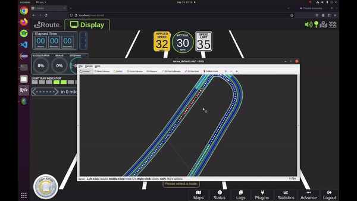
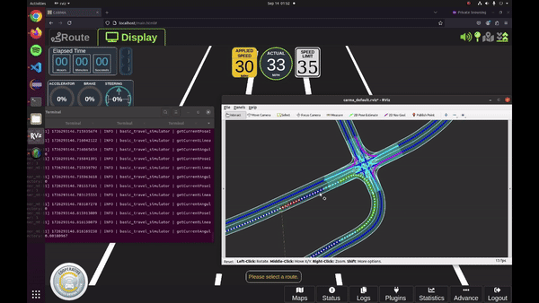

# Basic Travel Simulator

## Overview

The Basic Travel Simulator is a lightweight node designed to simulate basic vehicle movement based on planned trajectories. It serves as a valuable tool for testing and validating the CARMA Platform's planning stack without the need for a full simulation environment or live vehicle testing.

## Functionality

This node:

1. Subscribes to planned trajectories from the planning stack
2. Simulates basic vehicle kinematics based on these trajectories
3. Publishes simulated vehicle pose and twist data

NOTE: This node is meant to catch simple issues in the trajectory generation logic. It is not meant to replace full simulation or live vehicle testing.
Also, it bypasses any control level plugins and directly publishes the simulated state from the planned trajectory, so it will not catch issues related to the control layer.

## Purpose

The primary purpose of this simulator is to:

- Detect potential issues in trajectory generation logic in simple scenarios
- Identify problems in the planning stack (tactical or strategic)
- Uncover potential OSM map issues, which will again result in trajectory generation failures
- Provide a quick way to integration test simple scenarios without full simulation or live testing

## How to Enable

The Basic Travel Simulator is disabled by default but is enabled for local simulation in carma-config/development.
[Link to carma-config/development](https://github.com/usdot-fhwa-stol/carma-config/tree/develop/development)

For standalone CARMA Platform launch:

```
ros2 launch carma carma_src.launch.py enable_basic_travel_simulator:=true
```

## How to Use

Follow normal carma operations as if in a live environment. 
- `carma start all`
- Open browser and navigate to `localhost`
- Launch RVIZ from terminal and for select a pose on a valid map/road section
- Login to carma, select, route and engage.
- carma vehicle will follow the planned trajectory and simulate basic vehicle kinematics. Observe UI and RVIZ to confirm vehicle is following planned path.

## Example Scenarios

### Scenario 1: Insufficient Slowdown During Turn due to Unknown Issue



In this scenario, the vehicle fails to properly plan for slowing down during a turn when speed limit is set to 35mph. The Basic Travel Simulator allows the developer to catch this issue without the need for full simulation or live vehicle testing, indicating a potential problem with trajectory generation logic for this edge case.

### Scenario 2: Successful Turn After Deceleration Rate Tuning



After tuning the vehicle parameters to allow for a higher deceleration rate (although it may not be the best solution), the vehicle successfully slows down and makes the turn. This demonstrates how the Basic Travel Simulator can be used to quickly iterate and validate changes to the planning stack.

## Benefits

- Improves the local integration testing of planning stack changes
- Reduced reliance on full simulation or live testing for basic scenarios
- Faster and more efficient development cycles for CARMA Platform components

By using the Basic Travel Simulator, developers can quickly identify and address issues in the planning stack, leading to more robust and reliable autonomous driving behaviors in the CARMA Platform.