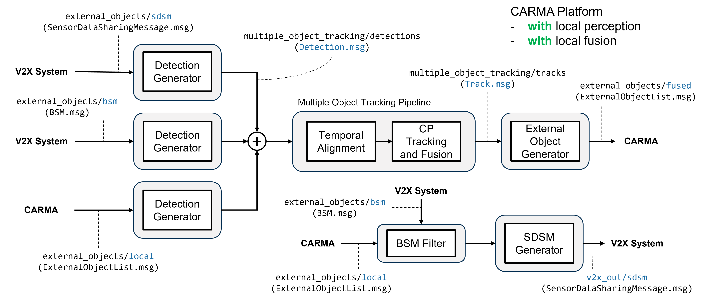
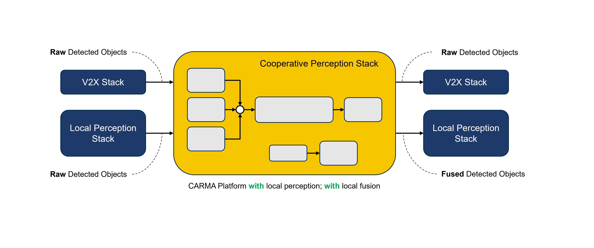
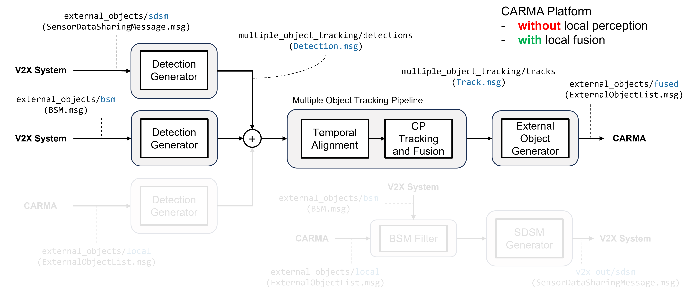
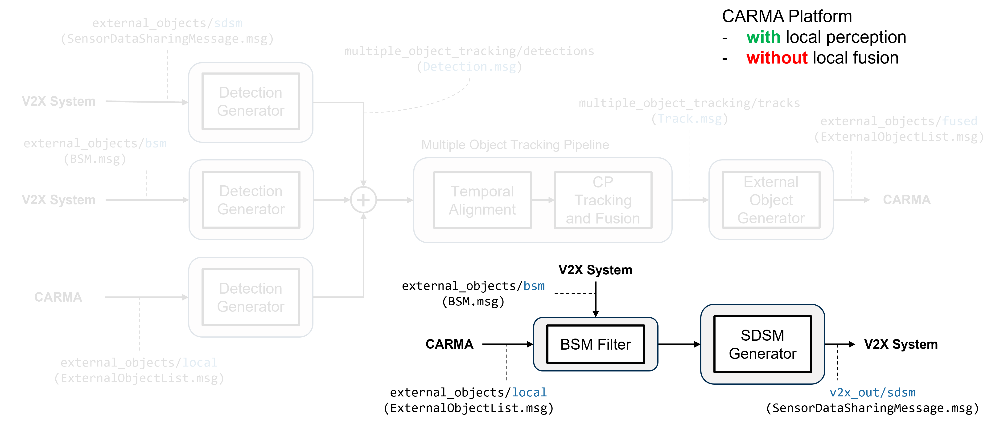
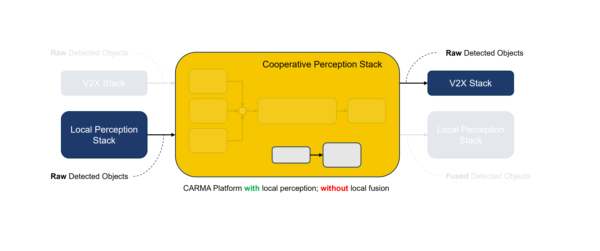
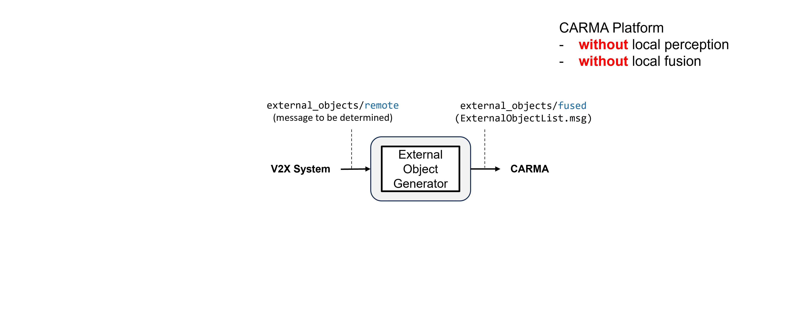
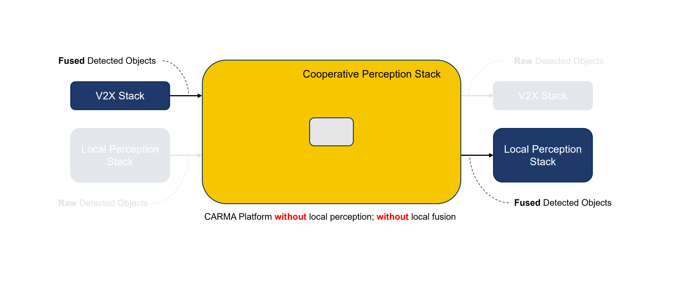

# CARMA cooperative perception - Stack design

The cooperative perception stack can take various forms depending on the deployed-to actor’s abilities. The subsections
below describe different configuration alternatives and what type of actors would most likely use them. For all of this
section’s figures, the gray rounded-boxes represent ROS 2 Nodes. Three main concepts distinguish the configurations:

- **Local perception:** an actor can perceive the environment using only its equipped sensors.
- **Local fusion:** an actor can use its own processing capabilities to combine several data sources about an object
  into a single representation.
- **External reliance:** an actor relies on some external entity to provide environment object information. These
  actors lack local perception, local fusion, or both capabilities.

The following table summarizes the different stack configurations.

| Local perception | Local fusion | External reliance |
| ---------------- | ------------ | ----------------- |
| Yes              | Yes          | No                |
| Yes              | No           | No                |
| No               | Yes          | Depends           |
| No               | No           | Yes               |

We assume all actors can receive incoming messages such as SDSMs, whether they can use that data is a different matter.
We also assume actors with local perception abilities have access to object-level data regarding the environment.

## Local perception and fusion

> [!IMPORTANT]\
> This stack configuration is currently unsupported because the required Nodes are unimplemented.

In this stack configuration variant, the host vehicle (HV) or host roadside unit (HRSU) can perceive objects using its
local sensors, and it can fuse remotely-received object data from BSMs and SDSMs. Actors using this configuration
broadcast sensor data sharing messages (SDSMs) containing locally-perceived objects. The figure below shows the Node
diagram for this deployment configuration.

## Local fusion only

> [!IMPORTANT]\
> This stack configuration is currently unsupported because the required Nodes are unimplemented.

Host vehicles (HVs) or host roadside units (HRSUs) using this deployment configuration are unable to perceive the
environment using only their local abilities (i.e., their own sensors). However, they can fuse object information they
receive from nearby actors into single representations using their own computational power. The figure below shows the
Node diagram for this deployment configuration.

Depending on the application or use case, actors with this stack configuration might rely on an external entity to
provide object data. If neighboring actors…

## Local Perception Only

> [!IMPORTANT]\
> This stack configuration is currently unsupported because the required Nodes are unimplemented.

In this stack configuration, the host vehicle (HV) or host roadside unit (HRSU) can use object information only from
its local sensors; it cannot fuse that data with any remotely-received object data. Actors using this stack deployment
variant do not use incoming SDSMs, but they still publish their local sensor data with others through SDSMs. The figure
below shows the Node diagram for this deployment configuration.

## No Local Perception or Fusion

> [!IMPORTANT]\
> This stack configuration is currently unsupported because the required Nodes are unimplemented.

> [!WARNING]\
> We do not recommend this stack configuration but included it for completeness. If you intent to use this
> configuration in your application, we suggest you reevaluate your approach.

In this stack configuration, the host vehicle (HV) or host roadside unit (HRSU) can neither perceive objects locally
nor fuse object data from nearby actors. The HV or HRSU is entirely dependent on an external system to provide an
authoritative list of environment objects. Essentially, actors with this configuration receive the all the cooperative
perception benefits without contributing themselves. The figure below shows the Node diagram for this deployment
configuration.

