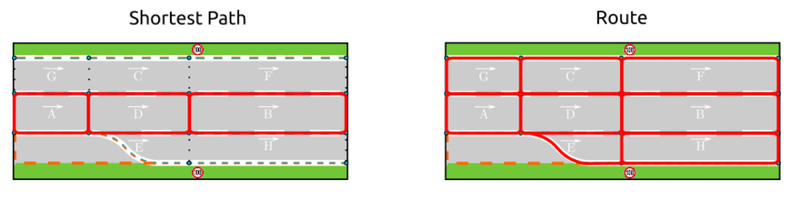
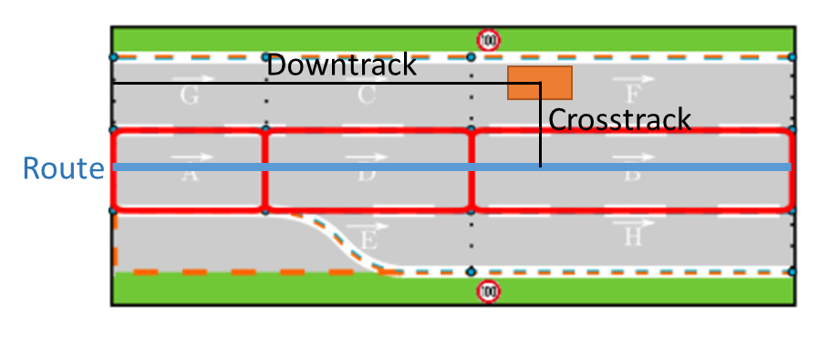
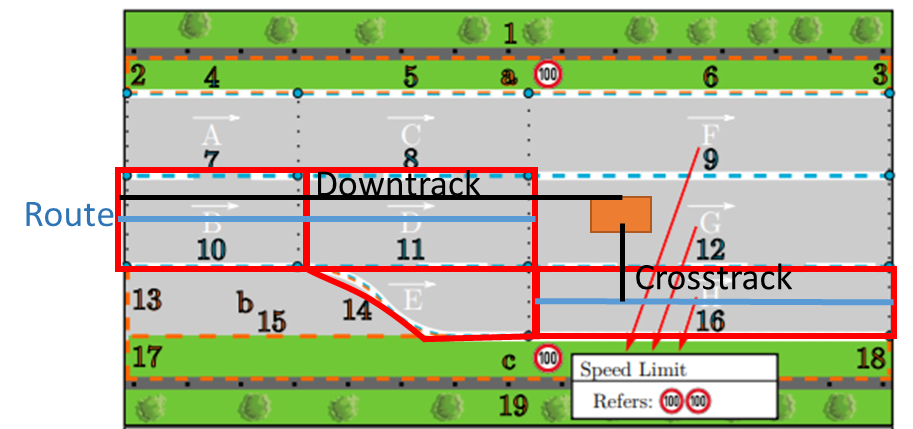

# carma_wm

This package provides the carma_wm C++ library which manages and simplifies accessing and querying the road network that the vehicle is operating in. This package makes heavy use of the [Lanelet2 C++ Library](https://github.com/fzi-forschungszentrum-informatik/Lanelet2) to represent road geometry and communicate with the rest of the CARMA Platform. A copy of the Lanelet2 License can be found [here](doc/LANELET2_LICENSE.md).  

## Library Role

The carma_wm library design was inspired by the [tf2 library](http://wiki.ros.org/tf2) in that it provides automatic subscription and message callbacks for semantic map and route updates in CARMA. Beyond this the library is designed for support a wider range of route-based computations than Lanelet2 provides by default, however it is expected that users will learn and use the Lanelet2 API directly for most non-route based needs. The library provides read-only access to the map and route objects. Map and route updating is handled by other components in the CARMA Platform.  

## Lanelet2 OSM File Format Changes

By default Lanelet2 supports a modified version of the OpenStreetMaps (OSM) file format to describe its roadways. See [here](https://github.com/fzi-forschungszentrum-informatik/Lanelet2/blob/master/lanelet2_maps/README.md) for an introduction. Part of this standard describes how road regulations are defined by interpreting tags on various Lanelet2 primitives. In addition, regulatory elements also fill a similar role. Unfortunately, this creates a confusing situation where some regulations are tied intrinsically to the physical markings on the road. For example, a double yellow line could never be crossed even if nearby signs instructed the user to do so around a work zone. To resolve this, while also preserving the description of the physical markings on the road, CARMA Platform supports an additional set of [regulatory elements](doc/RegulatoryElements.md). Using these regulations separates all road regulations from physical road markings allowing for situations such as the work zone use case described above. In addition, all Lanelet2 Maps must follow the Autoware.ai [Lanelet2 Extension tagging](https://github.com/usdot-fhwa-stol/autoware.ai/tree/carma-develop/common/lanelet2_extension) rules due to the use of legacy map handling nodes. This is a requirement which may be depercated in the future. If a Lanelet2 map is loaded which does not contain these elements the carma_wm_ctrl package will make a best effort attempt to add them using Lanelet2's default tagging rules before forwarding the map to components using the carma_wm library.

## Route Definition

LaneLet2 provides its own routing module. Details of this module can be found [here](https://github.com/fzi-forschungszentrum-informatik/Lanelet2/tree/master/lanelet2_routing) and should be reviewed before continuing in with this section. Lanelet2 generates a route by finding the shortest path of LaneLets between two points according to a user defined cost function. Then it will identify all the LaneLets which lie along the same roads as this path and include them in the description. The sequence of LaneLets which describe the original shortest path will also be preserved inside the route object. This can be seen below.


Depiction of shortest path compared with Lanelet2 route
Images sourced from Lanelet2 routing documentation found [here](https://github.com/fzi-forschungszentrum-informatik/Lanelet2/tree/master/lanelet2_routing).

To support the concept of downtrack and crosstrack distance often used for planning in cooperative applications the reference line will be defined by the center lines which lie along the route’s shortest path. This will remove ambiguity in where the reference line is located on the road as shown below.
 

Route line for calculating downtrack distance

When there are lane changes that occur along the route the line of reference will move to the following lane after the lane change lanelet as shown below. This will prevent the length of the adjacent lanelet being double counted.  
 

Route reference line at lane change location. Image sourced from Lanelet2 publication found [here](https://www.mrt.kit.edu/z/publ/download/2018/Poggenhans2018Lanelet2.pdf)

## Example Usage

### Initialization

Users should initialize the carma_wm by first creating an instance of the [WMListener](include/carma_wm/WMListener.h) object. This will automatically subscribe to the ```semantic_map``` and ```route``` topics which will provide map and route updates. By default the WMListener is single threaded and will only trigger callbacks when ```ros::spin()``` is called. However, as map and route updates can be time consuming there is a multi-threaded mode which can be enabled using WMListener constructor. This will use a ```ros::AsyncSpinner``` to update the map and route in the background. When this happens the user should take care to ensure thread safety when performing map or route access through the use of the ```WMListener.getLock()``` method.  

Once the user decides they need to access map or route information, they will do so through an instance of the [WorldModel](include/carma_wm/WorldModel.h) interface. This provides read access to map and route objects as well as functions for quickly computing downtrack or crosstrack distances. An instance of the WorldModel can be acquired using the ```WMListener.getWorldModel()``` method.  The WorldModel object is not thread safe on its own which is why usage of the ```WMListener.getLock()``` method is critical when using multi-threaded mode.

#### Single Threaded Example Code

```c++
#include <ros/ros.h>
#include <carma_wm/WMListener.h>
#include <carma_wm/WorldModel.h>
int main(int argc, char **argv)
{
  ros::init(argc, argv, "map_user");

  // Create WMListener after initializing ros
  // It is recommended only one instance be created per node
  carma_wm::WMListener wml; // Create single threaded listener instance. Equivalent to carma_wm::WMListener wml(false);

  carma_wm::WorldModelConstPtr wm = wml.getWorldModel(); // Get pointer to WorldModel

  ros::Rate loop_rate(10);
  while (ros::ok())
  {

    if (wml.getRoute()) { // Route object provided a shared_ptr so you can use it to check for availability
      lanelet::Point3d pt;

      carma_wm::TrackPos tc = wm->routeTrackPos(pt); // Get the downtrack and crosstrack position of the provided point on the route
    }
    ros::spinOnce();

    loop_rate.sleep();
  }

  return 0;
}

```

#### Multi-Threaded Example Code

```c++
#include <ros/ros.h>
#include <carma_wm/WMListener.h>
#include <carma_wm/WorldModel.h>
int main(int argc, char **argv)
{
  ros::init(argc, argv, "map_user");

  // Create WMListener after initializing ros
  // It is recommended only one instance be created per node
  carma_wm::WMListener wml(true); // Create multi-threaded listener instance by passing true constructor parameter

  carma_wm::WorldModelConstPtr wm = wml.getWorldModel(); // Get pointer to WorldModel

  bool routeReady = false;
  wml.setRouteCallback([&]() { // User can set callback to trigger when a new route or map is received. Works in single threaded case as well
   routeReady = true;
  });

  ros::Rate loop_rate(10);
  while (ros::ok())
  {

    auto lock = wml.getLock(); // Acquire lock. Now user can safely access map and route data
    if (routeReady) { 
      lanelet::Point3d pt;
      carma_wm::TrackPos tc = wm->routeTrackPos(pt); // Get the downtrack and crosstrack position of the provided point on the route
    }
    ros::spinOnce();

    loop_rate.sleep();
  }

  return 0;
}

```


